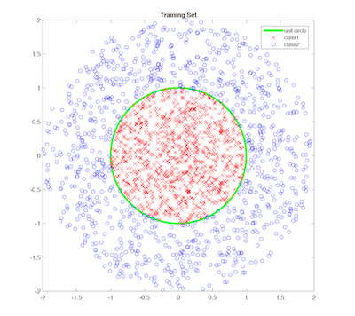
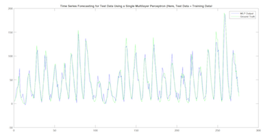
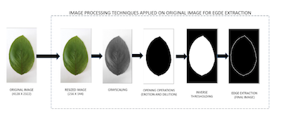
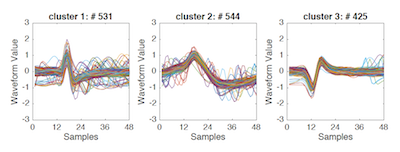

#XHANNProjects
This is a file including four prjects in ASU's EEE 511 course **Artifial Neural Network**. These four projects are completed by team of three: *Xiao Huang*, *Suhas Lohit* and *Rakshit Raghavan*.  
###Projects Overview
####Pattern Classification Using kNN and kMeans
In this assignment, we implement two simple nonlinear classifiers and test their classification performance on two 2D synthetic datasets - a non-separable dataset and a non-linearly separable dataset. We implement the k-Nearest Neighbor and the k-Means algorithms. Even though k-Means is a clustering algorithm used in unsupervised learning, we demonstrate how it can be used for classification. In each case, we compute the confusion matrix and compare their performance with each other. Through this, we gain the understanding of theory underlying each of these algorithms, their advantages and shortcomings and thus, their scope in terms of applying them in real world problems.  

####Time Series Forecasting
In this assignment, we use the multi-layer perceptron as well as an ensemble learning technique in order to perform time series forecasting. That is, given the present and few past values of a quantity e.g., stock price of a company, we predict its value in a future time instant. For training, we use the time series provided to us. For the multi-layer perceptron, we use the Levinburg-Marquardt algorithm to perform the backpropagation. For the ensemble learning model, we use bootstrap aggregating (bagging) by training multiple multilayer perceptrons with different initializations, different number of hidden neurons etc.  

####Plant Leaf Recognition Using SOM
In this assignment we demonstrate the use of Self Organizing Map (SOM) as a technique for plant leaf recognition. Given a set of leaves from different plants, we train the SOM
using different images of the same leaf. Once the network is trained, it can be used to identify plants when a particular leaf picture/image is the input. Such algorithms can be useful
for travelers, botanists and other plant enthusiasts. A number of geometrical aspects and other features of each plant leaf are extracted using image processing techniques. Once these
features are available, they are used as training data for the SOM and further analysis. We use the publicly available Folio dataset containing leaf images belonging to 32 different plants.
We compare the accuracy obtained by SOM with a k-Nearest Neighbor (k-NN) classifier and a Support Vector Machine (SVM).    
  

####Automated Spike Sorting
Neural spike sorting is a challenging unsupervised machine learning problem where neural spikes are to be clustered based on the similarity of their shapes. In this project, we have discussed various solutions to this problem and demonstrated the performance of our algorithms on the datasets provided. We look at different feature extraction techniques such as Principal Component Analysis, wavelets etc. and at different clustering algorithms. Of the algorithms considered, it was determined through the testing results that the combination of Haar wavelet features and Gaussian Mixture Models yielded the best clustering accuracy and we discuss in detail the results obtained. We also identify areas for further improvement of the algorithms considered.  
